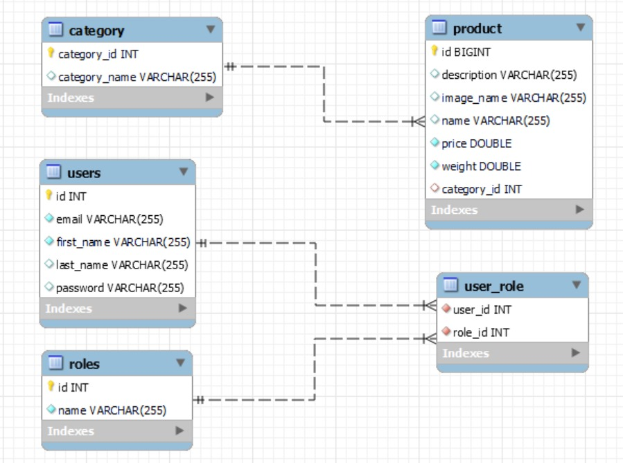

# E-Commerce Website

## Project Overview

This e-commerce website serves as a comprehensive platform for online shopping, featuring secure authentication, intuitive product browsing, and efficient cart management functionalities. Built using **Spring Boot**, **Thymeleaf**, and a **MySQL** database, it ensures a robust and scalable architecture suitable for modern e-commerce needs.

## Project Purpose

The aim of this project is to develop a fully functional e-commerce platform that allows users to browse products, manage their cart, and complete purchases. Additionally, it includes an admin interface for managing products, categories, and user orders.

## Features

- **User Registration and Login**
  - Sign up with email and password or through Google OAuth.
  - Secure login with role-based access control (user and admin).

- **Product Browsing**
  - Users can explore products organized by categories.

- **Shopping Cart**
  - Add, update, or remove items.
  - Cart summary with total price calculation.

- **Admin Dashboard**
  - Manage products and categories.
  - View and handle user orders.

## Functional Requirements

1. **User Registration and Login**
   - Users can register using an email and password or via Google OAuth.
   - Secure authentication with role-based access (user and admin).

2. **Product Browsing**
   - Users can view and search for products within categories.

3. **Shopping Cart**
   - Users can manage items in their cart (add, update, remove).
   - View a summary of the cart and calculate total prices.

4. **Admin Dashboard**
   - Admins have the capability to manage products and categories.
   - Admins can view and process user orders.

## Non-Functional Requirements

1. **Security**
   - Secure password storage with encryption.
   - CSRF protection and secure authentication practices.

2. **Performance**
   - Optimized for efficient data retrieval and handling.
   - Fast response times through optimized database queries.

## Technologies Used

- **Spring Boot**
- **Thymeleaf**
- **MySQL**
- **Bootstrap**
- **Google OAuth2**

## Use Case

### Actors
- **User**: Can browse products, manage their cart, and place orders.
- **Admin**: Can manage products, categories, and user orders.

### Use Cases
- **Browse Products**
- **Login/Logout**
- **Add to Cart**
- **Remove from Cart**
- **Admin: Manage Products**
- **Admin: Manage Orders**

## Class Diagram

## Sequence Diagram

### User Flow:
- **Index Page** → **Browse Products** → **View Product Details** → **Add to Cart** → **Login/Register** → **Authentication** → **View Cart** → **Remove from Cart** → **Checkout**

### Admin Flow:
- **Login** → **Admin Dashboard** → **Manage Products** → **Manage Categories** → **Logout**

## Thank You

Thank you for exploring this e-commerce website project. If you have any questions or wish to contribute, please feel free to open an issue or submit a pull request.

---

